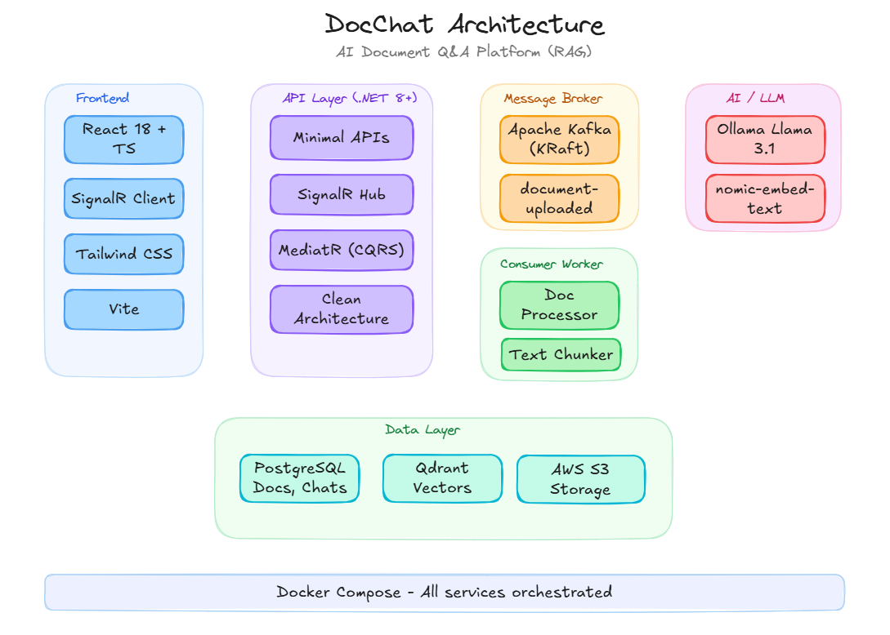

# DocChat — AI Document Q&A Platform

  A full-stack RAG (Retrieval-Augmented Generation) application that lets you upload documents and ask questions about them. Answers
  are generated from your actual documents with source citations — no hallucination.

  

  ## Architecture

  ```
  ┌──────────────┐       REST / WebSocket        ┌─────────────────────┐
  │              │  ◄──────────────────────────►  │                     │
  │   React 18   │                                │   .NET Minimal API  │
  │  TypeScript  │    SignalR (streaming tokens)   │   SignalR Hub       │
  │  Tailwind    │  ◄──────────────────────────►  │   MediatR (CQRS)    │
  │  Vite        │                                │   Clean Architecture│
  │              │                                │                     │
  └──────────────┘                                └──────┬──────┬───────┘
     :5173                                               │      │
                                                         │      │  Publish
                                                Read/    │      │  Event
                                                Write    │      ▼
                                                         │   ┌──────────────┐
                                                         │   │ Apache Kafka │
                                                         │   │ (KRaft mode) │
                                                         │   └──────┬───────┘
                                                         │          │ Consume
                                                         │          ▼
                                                         │   ┌──────────────┐
                                                         │   │   Consumer   │
                                                         │   │   Worker     │
                                                         │   │  ┌────────┐  │
                                                         │   │  │PDF Parse│  │
                                                         │   │  │Chunking │  │
                                                         │   │  └────────┘  │
                                                         │   └──────┬───────┘
                                                         │          │
                                ┌─────────────────┬──────┴──────────┤
                                ▼                 ▼                 ▼
                         ┌────────────┐   ┌─────────────┐   ┌────────────┐
                         │ PostgreSQL │   │   Qdrant     │   │   Ollama   │
                         │            │   │ Vector DB    │   │ Llama 3.1  │
                         │ Docs,Chats │   │ Embeddings   │   │ Embeddings │
                         │ Chunks     │   │ Search       │   │ Chat/Stream│
                         └────────────┘   └─────────────┘   └────────────┘
                            :5434             :6333             :11434

                ┌──────────────────────────────────────────────────────┐
                │        Docker Compose — One command startup          │
                └──────────────────────────────────────────────────────┘
  ```

  ## Tech Stack

  | Layer | Technology | Purpose |
  |-------|-----------|---------|
  | Frontend | React 18 + TypeScript + Tailwind CSS + Vite | Modern SPA with real-time streaming |
  | Backend API | .NET 8+ Minimal APIs | REST endpoints + SignalR hub |
  | Architecture | Clean Architecture + CQRS (MediatR) | Separation of concerns |
  | Database | PostgreSQL 16 | Documents, conversations, chat messages, chunks |
  | Vector DB | Qdrant | Embedding vectors for semantic search |
  | Message Broker | Apache Kafka (KRaft) | Async document processing pipeline |
  | Real-time | SignalR | Token-by-token chat response streaming |
  | LLM (default) | Ollama — Llama 3.1 | Free, local, no API key needed |
  | LLM (optional) | OpenAI GPT-4o-mini | Swappable via interface abstraction |
  | Embeddings | nomic-embed-text (Ollama) / text-embedding-3-small (OpenAI) | Document chunk vectorization |
  | Containerization | Docker Compose | All infrastructure in one command |

  ## How RAG Works in DocChat

  1. UPLOAD: PDF/TXT → Save to disk → Publish Kafka event
  2. PROCESS (async): Kafka Consumer → Extract text → Chunk (~500 chars)
  → Generate embeddings (Ollama) → Store vectors in Qdrant
  3. ASK: Question → Embed question → Search Qdrant (top 5 similar chunks)
  → Build prompt with context → Stream LLM response via SignalR
  → Save conversation to PostgreSQL

  ## Project Structure

  ```
  DocChat/
  ├── docker-compose.yml                  # PostgreSQL, Kafka, Qdrant, Ollama
  ├── nuget.config                        # NuGet package source config
  │
  ├── src/
  │   ├── DocChat.Domain/                 
  │   │   ├── Entities/
  │   │   │   ├── Document.cs
  │   │   │   ├── DocumentChunk.cs
  │   │   │   ├── Conversation.cs
  │   │   │   └── ChatMessage.cs
  │   │   └── Enums/
  │   │       └── DocumentStatus.cs
  │   │
  │   ├── DocChat.Application/            
  │   │   ├── Chat/Commands/
  │   │   ├── Documents/Commands/
  │   │   └── Common/Interfaces/
  │   │       ├── IDocumentRepository.cs
  │   │       ├── IConversationRepository.cs
  │   │       ├── ILlmService.cs
  │   │       ├── IEmbeddingService.cs
  │   │       ├── IVectorStore.cs
  │   │       ├── IFileStorage.cs
  │   │       └── IEventProducer.cs
  │   │
  │   ├── DocChat.Infrastructure/         
  │   │   ├── AI/
  │   │   │   ├── OllamaLlmService.cs
  │   │   │   └── OpenAiLlmService.cs
  │   │   ├── Embeddings/
  │   │   │   ├── OllamaEmbeddingService.cs
  │   │   │   └── OpenAiEmbeddingService.cs
  │   │   ├── VectorStore/
  │   │   │   └── QdrantVectorStore.cs
  │   │   ├── Kafka/
  │   │   │   └── KafkaProducer.cs
  │   │   ├── FileStorage/
  │   │   │   └── LocalFileStorage.cs
  │   │   └── Persistence/
  │   │       ├── AppDbContext.cs
  │   │       ├── Migrations/
  │   │       └── Repositories/
  │   │
  │   ├── DocChat.API/                    # Minimal API endpoints, SignalR hub
  │   │   ├── Endpoints/
  │   │   │   ├── DocumentEndpoints.cs
  │   │   │   └── ChatEndpoints.cs
  │   │   ├── Hubs/
  │   │   │   └── ChatHub.cs
  │   │   └── Program.cs
  │   │
  │   └── DocChat.Consumer/              # Kafka consumer worker
  │       ├── Workers/
  │       │   └── DocumentProcessingWorker.cs
  │       ├── Services/
  │       │   ├── PdfParserService.cs
  │       │   └── TextChunkerService.cs
  │       └── Program.cs
  │
  ├── client/                            # React frontend
  │   ├── src/
  │   │   ├── App.tsx
  │   │   ├── api/apiClient.ts
  │   │   ├── hooks/useSignalR.ts
  │   │   ├── types/index.ts
  │   │   └── components/
  │   │       ├── Chat/
  │   │       ├── Documents/
  │   │       ├── Sidebar/
  │   │       └── Layout/
  │   ├── vite.config.ts
  │   └── package.json
  │
  └── README.md
  ```

  ## Prerequisites

  - [.NET 8+ SDK](https://dotnet.microsoft.com/download)
  - [Node.js 18+](https://nodejs.org/)
  - [Docker Desktop](https://www.docker.com/products/docker-desktop/)
  - [EF Core CLI](https://learn.microsoft.com/en-us/ef/core/cli/dotnet): `dotnet tool install --global dotnet-ef`

  ## Quick Start

  ```bash
  # 1. Clone
  git clone https://github.com/YOUR_USERNAME/DocChat.git
  cd DocChat

  # 2. Start infrastructure
  docker-compose up -d

  # 3. Pull Ollama models (first time only, ~5GB)
  docker exec docchat-ollama ollama pull nomic-embed-text
  docker exec docchat-ollama ollama pull llama3.1

  # 4. Create database tables
  dotnet ef database update --project src/DocChat.Infrastructure --startup-project src/DocChat.API

  # 5. Start API (Terminal 1)
  dotnet run --project src/DocChat.API

  # 6. Start Kafka Consumer (Terminal 2)
  dotnet run --project src/DocChat.Consumer

  # 7. Start Frontend (Terminal 3)
  cd client && npm install && npm run dev

  # 8. Open http://localhost:5173

  Using OpenAI Instead of Ollama

  Set the OPENAI_API_KEY environment variable or update appsettings.json in both API and Consumer projects. Then swap the DI
  registration in Infrastructure/DependencyInjection.cs to use OpenAiEmbeddingService and OpenAiLlmService.

  Service Ports

  ┌──────────────────┬───────┬─────────────────────────────────┐
  │     Service      │ Port  │               URL               │
  ├──────────────────┼───────┼─────────────────────────────────┤
  │ React Frontend   │ 5173  │ http://localhost:5173           │
  ├──────────────────┼───────┼─────────────────────────────────┤
  │ .NET API         │ 5123  │ http://localhost:5123           │
  ├──────────────────┼───────┼─────────────────────────────────┤
  │ API Health       │ 5123  │ http://localhost:5123/health    │
  ├──────────────────┼───────┼─────────────────────────────────┤
  │ PostgreSQL       │ 5434  │ localhost:5434                  │
  ├──────────────────┼───────┼─────────────────────────────────┤
  │ Kafka            │ 9092  │ localhost:9092                  │
  ├──────────────────┼───────┼─────────────────────────────────┤
  │ Qdrant Dashboard │ 6333  │ http://localhost:6333/dashboard │
  ├──────────────────┼───────┼─────────────────────────────────┤
  │ Ollama           │ 11434 │ http://localhost:11434          │
  └──────────────────┴───────┴─────────────────────────────────┘

  Key Design Decisions

  - Kafka KRaft mode — no Zookeeper needed, simpler Docker setup
  - Ollama as default LLM — free, local, no API keys required
  - Interface abstractions (ILlmService, IEmbeddingService) — swap providers with one DI change
  - Minimal APIs over Controllers — modern .NET pattern, less boilerplate
  - SignalR for streaming — real-time token-by-token responses like ChatGPT
  - EF Core code-first — migrations manage schema changes
  - Async document processing — API responds instantly, Kafka consumer handles heavy work in background